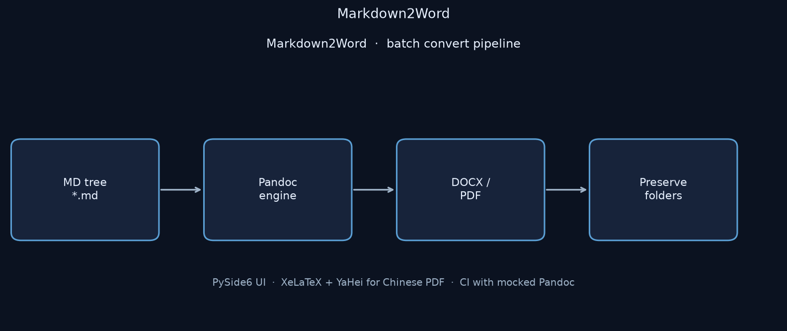

# Markdown2Word

**Batch Markdown → Word/PDF desktop converter: recursive folder tree, Pandoc engine, PySide6 shell.**

[English](README.md) | [中文](README.zh-CN.md)

[](https://github.com/Phoenix0531-sudo/Markdown2Word/actions/workflows/ci.yml)
[](LICENSE)

Pick an input folder of `.md` files, choose `docx` or `pdf`, keep the relative directory structure under the output root. Conversion is delegated to **Pandoc** via `pypandoc` / helper code — this app is the batch + UI shell, not a reimplementation of Pandoc.

## Preview



## Core conversion path (real code)

`converter/batch_converter.py`:

```python
md_files = glob.glob(os.path.join(input_dir, '**/*.md'), recursive=True)
for md_file in md_files:
    rel_path = os.path.relpath(md_file, input_dir)
    out_path = ... same tree ... + f'.{fmt}'
    convert_md_to_any(md_file, out_path, fmt, template)
```

Optional `progress_callback(idx, total, md_file)` for the UI progress bar.

`converter/pandoc_helper.py` wraps format-specific Pandoc invocation (including PDF variables for Chinese via XeLaTeX + Microsoft YaHei when configured).

## Layout

```
main.py                 # desktop entry
ui/                     # PySide6 windows / widgets
converter/
  batch_converter.py
  pandoc_helper.py
config/
tests/                  # Pandoc mocked — CI does not need a GUI
```

## Install

```bash
git clone https://github.com/Phoenix0531-sudo/Markdown2Word.git
cd Markdown2Word
pip install -r requirements.txt
# requires Pandoc on PATH
# Chinese PDF: XeLaTeX + Microsoft YaHei (or edit PDF vars)
```

Python **>= 3.10**. Deps: PySide6, pypandoc, markdown.

## Run

```bash
python main.py
```

Library:

```python
from converter.batch_converter import batch_convert
batch_convert("notes/", "out/", fmt="docx")
batch_convert("notes/", "out/", fmt="pdf", template=None)
```

```bash
pytest tests/
```

## Scope

- **In:** recursive batch convert, structure-preserving outputs, desktop UX, optional template
- **Out:** collaborative cloud editor, perfect CSS-print fidelity for arbitrary HTML, multi-user API

## License

MIT. See [LICENSE](LICENSE).
